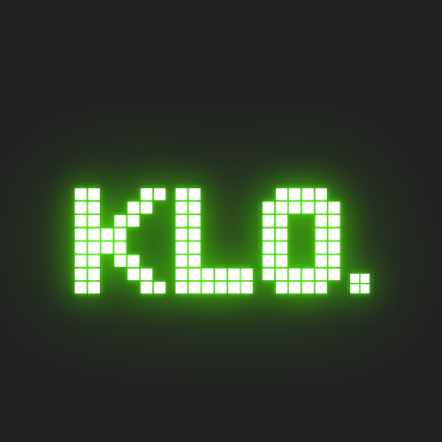

# Klo. 🎮

<div align="center">



**Retro 8-bit/16-bit Temalı Klotski Bulmaca Oyunu**

[](https://www.python.org/)
[](https://www.pygame.org/)
[](LICENSE)
[](https://github.com/ness246/Klo.)

[🎮 Demo Sayfası](https://ness246.github.io/Klo./) • [📦 İndir](https://github.com/ness246/Klo./archive/refs/heads/main.zip) • [🐛 Hata Bildir](https://github.com/ness246/Klo./issues)

</div>

---

## 📖 Hakkında

**Klo.**, 20. yüzyılın başlarında ortaya çıkan klasik Klotski bulmacasının modern bir yorumudur. Retro 8-bit/16-bit estetiğiyle harmanlanmış, göz dostu renkler ve akıcı oynanış sunan bir puzzle oyunudur.

Hedef bloğu (2x2 sarı blok) EXIT noktasına taşıyarak her seviyeyi tamamlayın. Minimum hamle ve süre ile çözerek kendinize meydan okuyun!

## ✨ Özellikler

### 🎨 Görsel ve Tasarım
- **Retro 8-bit/16-bit Tema**: Atari/NES/SNES esintili görsel tasarım
- **Göz Dostu Renkler**: Göz yormayan, yumuşatılmış retro renk paleti
- **Parlayan Efektler**: Blokları sürüklerken hafif glow efektleri
- **Modern Arayüz**: Koyu tema, çerçeveli arayüz, pixelated font desteği

### 🎮 Oynanış
- **Sürükle-Bırak Kontrolleri**: Blokları fare ile akıcı şekilde hareket ettirin
- **Süre Takibi**: Her bulmacayı ne kadar hızlı çözdüğünüzü görün
- **Hamle Sayacı**: Minimum hamleyle çözerek kendinize meydan okuyun
- **Geri Alma**: Son hamleyi geri alın (U tuşu)
- **Yeniden Başlat**: Puzzle'ı sıfırdan başlatın (R tuşu)
- **Önizleme Sistemi**: Blokları sürüklerken altında görünen preview efekti

### 🎵 Ses ve Müzik
- **8-bit Ses Efektleri**: Hareket, hata ve buton tıklama sesleri
- **Arkaplan Müziği**: Çeşitli retro temalı müzik parçaları
- **Ses Kontrolleri**: Ses efekti ve müzik seviyelerini ayarlayın
- **Dinamik Müzik**: Oyun başladığında rastgele müzik seçimi

### 🌍 Dil ve Yerelleştirme
- **Çoklu Dil Desteği**: Türkçe ve İngilizce
- **Kolay Dil Değiştirme**: Ayarlar menüsünden dil seçimi
- **Yerelleştirilmiş Arayüz**: Tüm metinler çeviri sistemine dahil

### ⚙️ Ayarlar ve Özelleştirme
- **Tam Ekran Modu**: F11 ile tam ekran oynayın
- **Ayarlar Menüsü**: Ses, müzik ve dil ayarları
- **Durum Kaydetme**: Oyun tercihleriniz otomatik kaydedilir
- **Esnek Çözünürlük**: Fullscreen'de otomatik ölçeklendirme

### 📚 İçerik
- **Nasıl Oynanır Kısmı**: Oyun kuralları ve kontroller
- **Çoklu Seviye**: Farklı zorluk seviyelerinde bulmacalar
- **Başarı Sistemi**: Her seviye için tamamlanma istatistikleri

## 🎮 Kontroller

| Tuş/İşlem | Açıklama |
|-----------|----------|
| **Fare** | Blokları sürükleyip bırakarak hareket ettirin |
| **U** | Son hamleyi geri al |
| **R** | Bulmacayı yeniden başlat |
| **ESC** | Ana menüye dön / Oyunu duraklat |
| **F11** | Tam ekran modunu aç/kapa |

## 🚀 Kurulum

### Gereksinimler

- **Python 3.7+**
- **Pygame** (otomatik yüklenir)

### Kurulum Adımları

1. **Projeyi İndirin**
   ```bash
   git clone https://github.com/ness246/Klo..git
   cd Klo.
   ```
   
   Veya GitHub'dan ZIP olarak indirin.

2. **Bağımlılıkları Yükleyin**
   ```bash
   pip install -r requirements.txt
   ```

3. **Oyunu Çalıştırın**
   ```bash
   python main.py
   ```

### Font Dosyası (Opsiyonel)

Oyun için özel pixelated font (`Bytesized.ttf`) kullanılmaktadır. Font dosyası `assets/fonts/` klasörüne yerleştirilmelidir. Eğer dosya bulunamazsa, sistem varsayılan fontu kullanılacaktır.

## 📦 Proje Yapısı

```
Klo./
├── main.py                 # Ana oyun dosyası
├── README.md              # Bu dosya
├── LICENSE                # MIT Lisansı
├── requirements.txt        # Python bağımlılıkları
├── settings.json          # Kullanıcı ayarları (otomatik oluşturulur)
├── logo.png              # Oyun logosu
├── index.html            # GitHub Pages web sitesi
├── assets/
│   ├── audio/            # Ses ve müzik dosyaları (otomatik oluşturulur)
│   └── fonts/            # Bytesized.ttf font dosyası
└── levels/               # Oyun seviyeleri (JSON formatında)
    ├── A-01.json
    └── B-01.json
```

## 🎯 Oyun Kuralları

1. **Amaç**: Hedef bloğu (2x2 sarı "T" bloğu) EXIT noktasına taşıyın.
2. **Hareket**: Blokları fare ile sürükleyerek hareket ettirebilirsiniz.
3. **Kısıtlamalar**: Bloklar sadece yatay veya dikey hareket edebilir, çapraz hareket yoktur.
4. **Çarpışma**: Bloklar birbirinin üzerine gelemez veya tahtanın dışına çıkamaz.
5. **Hedef**: EXIT noktası genellikle tahtanın alt kısmında, 2x2 boyutundadır.

## 🎵 Müzik ve Sesler

Oyun içerisinde kullanılan müzikler ve ses efektleri:

- **Ses Efektleri**: 8-bit temalı, programatik olarak oluşturulmuş sesler
- **Arkaplan Müziği**: Retro temalı müzik parçaları
- **Yapımcı Bilgisi**: Müzik yapımcıları müzik dosya isimlerinde belirtilmiştir

## 🌐 Web Sitesi

Projenin GitHub Pages demo sayfasını ziyaret edin:

🔗 **[https://ness246.github.io/Klo./](https://ness246.github.io/Klo./)**

Web sitesi retro 8-bit/16-bit temasıyla tasarlanmış ve projenin tüm bilgilerini içermektedir.

## 🛠️ Teknoloji

- **Python 3.7+**: Programlama dili
- **Pygame**: Oyun motoru ve grafik kütüphanesi
- **JSON**: Seviye ve ayar dosyaları
- **HTML/CSS/JS**: Web sitesi (GitHub Pages)

## 📝 Geliştirme

### Seviye Oluşturma

Seviyeler JSON formatında `levels/` klasöründe saklanır. Örnek format:

```json
{
  "id": "A-01",
  "grid": {"cols": 4, "rows": 5},
  "blocks": [
    {"id": "T", "w": 2, "h": 2, "x": 1, "y": 0, "type": "target", "color": "T"},
    {"id": "L", "w": 1, "h": 2, "x": 0, "y": 0, "color": "red"}
  ],
  "par": 20,
  "exit": [1, 3],
  "difficulty": 2
}
```

### Katkıda Bulunma

1. Fork yapın
2. Feature branch oluşturun (`git checkout -b feature/yeni-ozellik`)
3. Değişikliklerinizi commit edin (`git commit -m 'Yeni özellik eklendi'`)
4. Branch'inizi push edin (`git push origin feature/yeni-ozellik`)
5. Pull Request oluşturun

## 🐛 Bilinen Sorunlar

Şu anda bilinen önemli bir sorun yoktur. Hata bulursanız lütfen [GitHub Issues](https://github.com/ness246/Klo./issues) üzerinden bildirin.

## 📄 Lisans

Bu proje [MIT Lisansı](LICENSE) altında lisanslanmıştır. İstediğiniz gibi kullanabilir, değiştirebilir ve dağıtabilirsiniz.

## 👨‍💻 Geliştirici

**Ness246**

- GitHub: [@ness246](https://github.com/ness246)
- Proje: [Klo. Repository](https://github.com/ness246/Klo.)

## 🙏 Teşekkürler

- Klotski bulmacasının orijinal yaratıcıları
- Pygame geliştiricileri
- Retro oyun topluluğu
- Müzik yapımcıları (müzik dosya isimlerinde belirtilmiştir)

## 📞 İletişim

Sorularınız, önerileriniz veya geri bildirimleriniz için [GitHub Issues](https://github.com/ness246/Klo./issues) kullanabilirsiniz.

---

<div align="center">

**⭐ Bu projeyi beğendiyseniz yıldız vermeyi unutmayın! ⭐**

Made with ❤️ and 🎮 by Ness246

</div>
